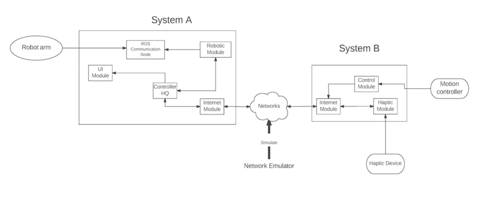

# CYTON-VETA-7-DOF-Robot-Sensing-Touch

## Background

Robots are used in a wide range of situations, which assist human in dangerous and complicated operations. The topic of Robotics covers the fields in Engineering and Science including Computer Science and Electrical Engineering. With the help of network, today’s tele- robotic systems can provide feedback to the operator. For example, the video and sound. However, they still lack the ability to convey sensory information such as reflected force, which is called haptics. Potentials and abilities are limited because of insufficient feedback. For instance, although total endoscopic cardiac surgery can be conducted by computer- assisted robotic surgical systems, the complex and delicate surgical tasks cannot be performed without tactile or haptic feedback. These limitations drive robotic engineers to implemented haptic feedback in the modern robotic systems to achieve faster and more precise control. Therefore, this project aims to explore the field of haptic feedback in the robotic systems. The background study covers the topics of Communication Systems, Control and Embedded Systems, as well as Networking and Wireless Engineering.

## Project Description
The purpose is to remote control a networked robotic arm that with a gripper at the end as well as feedback the pressure. The pressure is designed to be reproduced on a haptic device, thus the user can feel the pressure. Moreover, real-world robotic systems are required to be able to convey long-distance transmission via network, thus network impairments, such as delay and packet loss, which can affect the contact point and amount of force exerted, should be introduced and tested. The objectives are:
- Controlling the robot via Robot Operating System (ROS)
- Implement the force sensors to get pressure
- Reproduce the pressure on haptic device
- Introduce network impairments
- Creating Graphical User Interface (GUI)

When the project is completed, the robot should be able to listen the commands, and
feedback the pressure that felt by the gripper on the haptic device.

### Design

### Working Flow

### Online test between client and server

### Blogs & Video
[Link to blogs](http://shuhuihefyp.blogspot.co.uk/)

[Link to demo video](https://youtu.be/Em33JU7nFUo)
